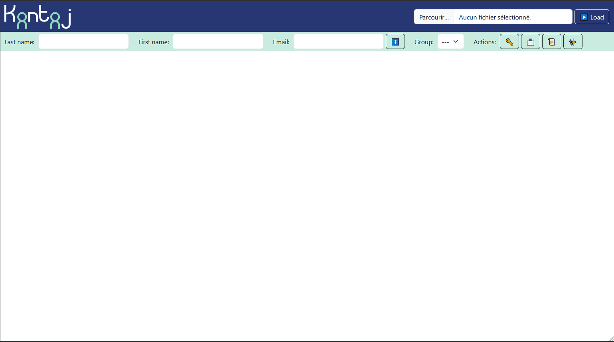
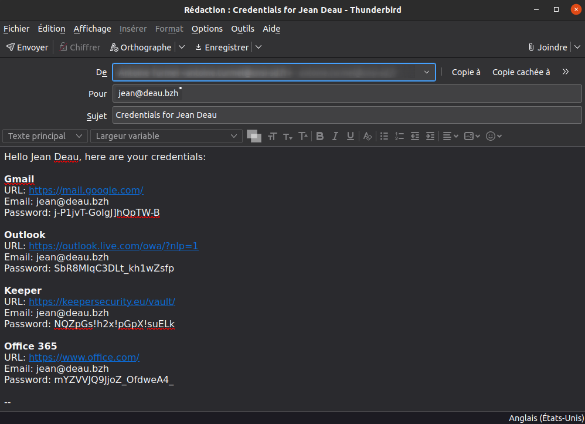

# kontojkreado

A web tool to help create accounts on web services, based on a JSON file.

## How to use Kontoj v1.1:
### Load your custom services:
- Copy [src/services.example.json](src/services.example.json) from project
- Fill your services details inside this file (you can validate your file using this schema: [src/services.schema.json](src/services.schema.json), you can also edit the file using [web json-editor](https://pmk65.github.io/jedemov2/dist/demo.html))
- In Kontoj, browse for your services.json file, then click on « Load » to load the list of services.

💡 **NOTE: In future version, it will be possible to save the JSON file inside the browser.**

### Autofill
Starting in v1.1, you can autofill fields using jQuery selectors, you can see an example in services.example.json & list of possible fields in services.schema.json

Autofill is provided by an « Userscript », you will need a browser extension like [Violentmonkey](https://violentmonkey.github.io/get-it/) or [Tampermonkey](https://www.tampermonkey.net/) to install [Kontoj Companion](/src/js/kontoj_companion.user.js).

### Generate and fill emails/passwords
- On the top bar, you can fill the Last Name/First Name, Email of the person
- You can either check manually each service, check service group or select user Group in top bar
- You can use the « Fill » ⏬ button to copy the mail into each email fields of selected services
- You can use the « Password » 🔑 button to generate a password (based on rules defined in config.json) for the selected service, or every services checked (if clicked from top bar)
- You can use the « Generate mail » 📨 button to generate a mail body with all credentials
- You can choose between "body" (Generally compatible with all service/software) of "html-body" (Compatible with Mozilla Thunderbird) using the 🛠️ Settings button.

### Login & Create Account
- Using « Login » 🚪 button you can go to the login page of the service
- Using « Create Account » 👤 button you can go the create account page of the service

💡 **NOTE: If you have Kontoj Companion installed & the service have autofill fields, clicking on the «Create Account » 👤 will automatically fill fields.**

### Live Demo

Load services & fill mail/password

Generated mail

## Dev instructions:
- Install nodejs/npm
- npm install
- npx serve src

## Licence

Kontoj is under [MIT Licence](/LICENSE)