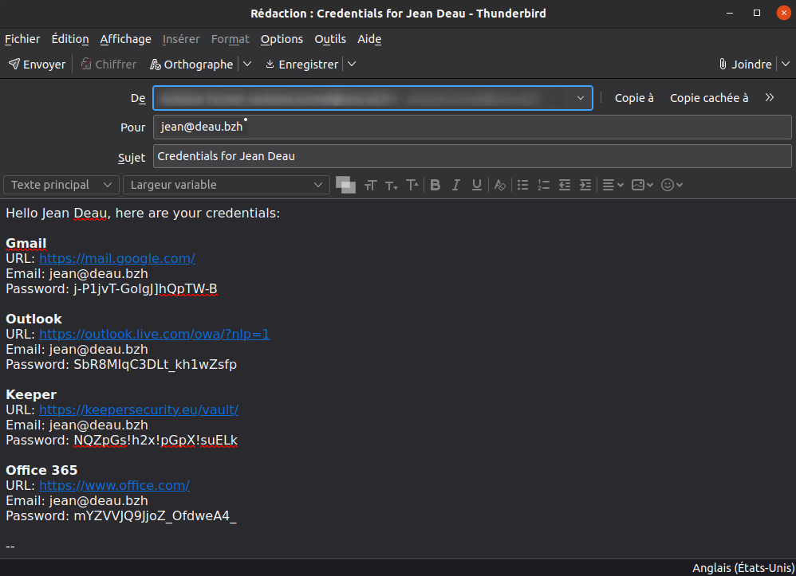

[](https://kontoj.galaksio.tech)

[](https://www.paypal.me/AntoineTURMEL)
[](https://github.com/galaksiotech/kontoj)

Un outil web facilitant la création de comptes sur des services web, en se basant sur un fichier JSON.

## Language de la documentation :
- [English](../README.md)
- [Français](README-fr.md)

## Comment utiliser Kontoj v2.0 :
### Charger votre liste de services :
- Copiez [src/services.example.json](../src/services.example.json) à partir du projet
- Remplissez les détails de vos services à l'intérieur du fichier (Vous pouvez valider votre fichier en utilisant ce schéma : [src/services.schema.json](../src/services.schema.json), vous pouvez aussi éditer ce fichier en utilisant [web json-editor](https://pmk65.github.io/jedemov2/dist/demo.html))
- Dans Kontoj, sélectionnez votre fichier services.json pour charger la liste des services.

### Charger automatiquement une liste de services :
- Vous pouvez charger automatiquement un fichier contenant une liste de services en le mettant à la racine (src) de Kontoj et en le spécifiant dans le fichier config.json
exemple :
```json
"autoload": "monfichier.json"
```
> [!NOTE]
> **Dans une future version, il sera possible d'enregistrer le fichier JSON dans le navigateur.**

### Auto-complétion
Vous pouvez auto-compléter les champs en utilisant des [sélecteurs CSS valides](https://developer.mozilla.org/fr/docs/Web/API/Document/querySelector#param%C3%A8tres), vous pouvez voir un exemple dans le fichier services.example.json & voir la liste des champs possibles dans le fichier services.schema.json.

> [!IMPORTANT]
> L'auto-complétion fonctionne grâce à un « Userscript », il est nécessaire d'installer une extension de navigateur comme [Violentmonkey](https://violentmonkey.github.io/get-it/) ou [Tampermonkey](https://www.tampermonkey.net/) pour installer le [Companion Kontoj](../src/js/kontoj_companion.user.js).

### Générer et remplir les adresses e-mail/mots de passe
- Dans la barre du haut, vous pouvez remplir le Nom/Prénom, adresse e-mail de la personne
- Vous pouvez choisir manuellement chaque service, choisir un groupe de services ou sélectionner un groupe utilisateur dans la barre du haut
- Vous pouvez utiliser le bouton « Remplir »  pour copier l'adresse e-mail dans chaque champ e-mail des services sélectionnés et générer un mot de passe (basé sur les règles définies dans le fichier JSON) pour chaque service sélectionné
- Vous pouvez utiliser le bouton « Générer le mail »  pour générer le contenu du mail à envoyer avec tous les identifiants
- Vous pouvez utiliser le bouton « Générer le mot de passe »  pour générer let mot de passe (basé sur les règles définies dans le fichier JSON) pour le service sélectionné
- Vous pouvez choisir la génération de mail entre "body" (Généralement compatible avec tous les services/logiciels) ou "html-body" (Compatible avec Mozilla Thunderbird) en utilisant le bouton « Paramètres » .

### Connexion & Création de compte
- Vous pouvez accéder à la page de connexion d'un service en cliquant sur le nom du service ou son logo
- En utilisant le bouton « Créer un compte »  vous pouvez accéder à la page de création de compte de votre service

> [!TIP]
> **Astuce : Si vous avez le Companion Kontoj d'installé & que le service contient des champs auto-complété, cliquer sur « Créer un compte »  remplira automatiquement les champs.**

### État du service
Vous pouvez spécifier un lien vers la page d'état de service, il peut être ouvert dans un iframe si le site le permet. Pour y accéder, cliquez sur le bouton d'état de service : 

### Companion Kontoj

L'objectif principal du Companion Kontoj est de vous aider à remplir les informations de connexion d'un service en toute simplicité.

Vous pouvez avoir plus de renseignements sur comment l'installer en cliquant sur le bouton « Companion Kontoj » : 

Vous pouvez configurer :
- La règle de suppression des informations de connexion (ces informations sont stockées dans l'extension comme par exemple TamperMonkey) ;
    - ```-1``` : Les informations sont supprimées une fois que vous avez cliqué sur le bouton de création de compte dans Kontoj.
    - ```0``` : Les informations ne sont jamais supprimées.
    - ```valeur positive``` exemple 5 : Les informations sont supprimées après X minutes.

> [!NOTE]
> **Par défaut la suppression se fait au bout de 5 minutes.**

Dans la version v2.0, la configuration se fait dans le menu de l'extension, exemple dans TamperMonkey:


### Démonstration

Chargement des services & remplissage des adresses mail/mots de passe

https://github.com/user-attachments/assets/c3cd1286-d035-4188-a3ca-76588cf52765

Companion Kontoj avec remplissage automatique

https://github.com/user-attachments/assets/4b715256-8fb2-4e72-9a3e-d1a974fb38a6

Génération du mail


## Instructions développeur :
- Installez nodejs/npm
- npm install
- npx serve src

Il est possible de pré-remplir le prénom, nom, email et groupe au lancement de Kontoj en ajoutant ce bloc dans le fichier config.json :
```json
    "dev": {
        "autofillFirstname": "Maurice",
        "autofillLastname": "Moss",
        "autofillEmail": "maurice.moss@reynholm-industries.com",
        "autofillGroup": "it"
    }
```

## Licence

Kontoj est sous licence [MIT Licence](../LICENSE)